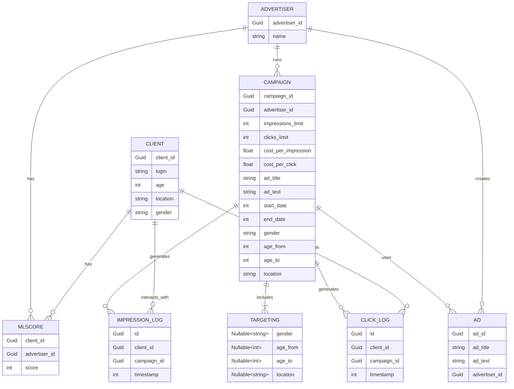

# Документация по PromountApp

### Выбранные технологии

---
- Веб фреймворк - `ASP.NET 9.0` мощный фреймворк для разработки веб приложений, имеет поддержку многих веб инфраструктур,
определяет общие паттерны построения проекта, удобен в использовании и конфигурировании, а оптимизации JIT (спасибо [Егору][egorBo]) ускоряют приложение,
является частью огромной экосистемы `.NET` с большим комьюнити.

- ЯП - `F#`, хоть и хуже чем `С#` взаимодействует с некоторыми компонентами в `ASP.NET`, но является ФП языком, что например 
позволяет писать монады, Computation Expressions, тип суммы, конвейеры и композиция: 
поддерживает использование функций высшего порядка, что позволяет легко создавать конвейеры и композировать функции, 
делая код более модульным и повторно используемым, 
иммутабельность по умолчанию позволяет избежать потери данных в многопоточных сценариях (удобно для параллелизма)

- СУБД для хранения данных моделей - `Postgres` обладает высокой производительностью и масштабируемостью, 
поддерживается `EntityFramework`'ом, можно эффективно выполнять массовые вставки (bulk inserts) для вставки большого количества данных.

- СУБД для кеширования - `Redis`, для хранения одной переменной (текущее время на сервере); более эффективное, быстрое и удобное решение,
лучше чем использование Postgres для дынной цели.

- Визуализация метрик - более удобный вариант взять `Grafana`, удобную веб оболочку, также существуют много дешбордов для `.NET`.
Собирает графики с различных провайдеров (Loki, Prometheus), которые поддерживаются основными библиотеками `.NET` и OTel

### Запуск сервисов

---
Для настройки переменных окружения используется файл `.env`

Переменные окружения:

| Имя            | Описание                                                          |
|----------------|-------------------------------------------------------------------|
| DB_CONNECTION  | Определяет строку подключения, используется синтаксис **ADO.NET** |
| ZHIPU_KEY      | Ключ для использования GLM-4 API                                  |
| S3_BUCKET_NAME | Имя бакета для хранения изображений рекламных кампаний            |
| S3_LOCATION    | Регион хранилища данных Yandex Data Storage                       |
| S3_ACCESS_KEY  | Публичный ключ доступа к Yandex Data Storage                      |
| S3_SECRET_KEY  | Приватный ключ доступа к Yandex Data Storage                      |

Запуск производится с помощью `./compose.yaml` файла.
### Тестирование

---
#### Unit тестирование

Для запуска юнит тестов используется:
```shell
dotnet test PromountApp/PromountApp.Api.Tests
```

#### Нагрузочное тестирование

Для нагрузочного тестирования используется **JMeter**, сценарии можно найти по пути ``./StressTests/``

### Метрики

---
Для сбора информации и наблюдения за приложением используется **OpenTelemetry**

Для визуализации данных используется **Grafana**, на порту``3000``

Стандартный пароль от панели Grafana: ``admin``

> **ВНИМАНИЕ**
> 
> Если при просмотре дешбордов отображается ``No data``, то необходимо вручную импортировать дешборды из ``grafana/provisioning/dashboards/``
> В качестве провайдера указать ``promethous``
> (так же возможно, что надо немного подождать и перезагрузить графики)

### Логирование

---
Для логирования используется Serilog и Loki

Для просмотра логов приложения используется Grafana, по адресу ``http://localhost:3000``
(дешборд под названием "Errors")

### Алгоритм подбора таргетированной рекламы

---
Алгоритм находится по пути `./PromountApp/PromountApp.Api/Services/AdMatchEngine.fs`

Представляет собой сплетение функций агрегации, фильтрации, группировки, свёртки,
и всё выполняется параллельно с глубиной параллелизма равной числу логических ядер процессора

_**Шаги алгоритма:**_

1. Взять все активные рекламные кампании подходящие под целевого клиента (таргетинг кампании полностью совпадает с параметрами клиента)
2. Назначить каждой очки близости к клиенту, соответствующие баллы представлены в самом начале файла,
при их суммировании определяется таргетированная реклама, наиболее подходящая клиенту.
В дальнейшем эта кампания будет соревноваться между кампаниями без таргетинга (общие кампании)
3. Берём таргетированную кампанию (если она нашлась, если не нашлась то берётся заглушка с 0 баллами)
4. Получаем общие кампании, где цена или ml score выше, чем у таргетированной кампании
5. Финальная выборка. Из всех полученных на предыдущих этапах кампаний, выбирается та,
где прогресс до поставленной цели меньше всего.

- Если были найдены 2 (или более) лучших кандидата, финальные очки которых равны, выбирается случайная (немного рандома)

- Благодаря введению метрики прогресса кампании до цели, можно получать кампании по очереди, ставя в приоритет, 
те которые меньше всего выполнили до цели. 
(например если есть 3 кампании: 
1 - самая подходящая по таргетингу, 
2 - самая прибыльная, 
3 - самая подходящая по мл скор,
то они будут показываться по очереди)

- Если в таргетинге, опциональный параметр указан, и он не соответствует параметру клиента, то такая
кампания не проходит через фильтр

- Все основные эвристики и формулы лежат в начале файла

### LLM

---
#### Генерация текста
Веб API предоставляет возможность сгенерировать текст для рекламной кампании

Запрос (**GET**) нужно отправлять на `/advertisers/{advertisersId}/campaigns/{campaignsId}/gen-text`
предварительно создав кампанию и рекламодателя, для генерации используется информация исходя
из предоставленной кампании и имени рекламодателя.

Время генерации примерно 10 с.

Для генерации используются модели построенные на **Alibaba MNN** (ZHIPU)

- Модели:  `glm-4-plus` | `glm-4-0520` | `glm-4` | `glm-4-air` | `glm-4-airx` | `glm-4-long` | `glm-4-flash`

- Если лимит одной из них вышел, то идёт переключение на более упрощённую.

### Хранение изображений рекламных кампаний
Управление изображением производится через `/advertisers/{advertisersId}/campaigns/{campaignsId}/img`

Методы `GET`, `POST`, `DELETE` - получение; добавление/обновление; удаление 

Для прикрепления файла к запросу нужно использовать формат `multipart/form-data`,
параметр - `image`, прикреплять можно только `.jpg`; `.jpeg`; `.png`; `.gif`

Изображения хранятся в `Yandex Data Storage`

---

### Схема отношений моделей СУБД

---
(для отображения необходима поддержка Mermaid)


[egorBo]: https://github.com/EgorBo