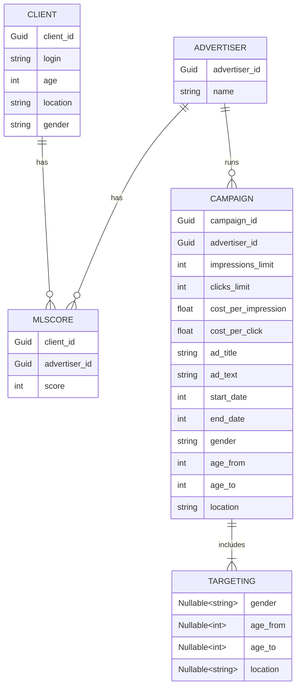

# Документация по PromountApp

---
### Запуск сервисов

---
Для запуска необходимо создать файл .env по шаблону ``.env.example``

Переменные окружения:

| Имя           | Описание                                                          |
|---------------|-------------------------------------------------------------------|
| DB_CONNECTION | Определяет строку подключения, используется синтаксис **ADO.NET** |

### Тестирование

---
#### Unit тестирование

Для запуска юнит тестов используется:
```shell
dotnet test PromountApp/PromountApp.Api.Tests
```

#### Нагрузочное тестирование

Для нагрузочного тестирования используется **JMeter**, сценарии можно найти по пути ``./StressTests/``

### Метрики

---
Для сбора информации и наблюдения за приложением используется OpenTelemetry

Для визуализации данных используется Grafana, по адресу ``http://localhost:3000``

Стандартный пароль от панели Grafana: ``admin``

> **ВНИМАНИЕ**
> 
> Если при просмотре дешбордов отображается ``No data``, то необходимо вручную импортировать дешборды из ``grafana/provisioning/dashboards/``
> В качестве провайдера указать ``promethous``

### Схема отношений моделей СУБД
(для отображения необходима поддержка Mermaid)
